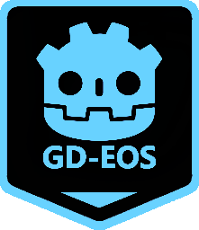

# GD-EOS

[Click here to refer English Readme](README.md).



适用于Godot的**Epic Online Services**。可作为**C++ SDK**或者编译后作为**GDScript SDK**。

## 特性

1. Godot风格的面向对象,所有的接口均尽可能的类型化。
2. 几乎所有的接口都是从 EOS 的 C SDK 生成，你可以直接查看 Epic Online Services 的文档。
3. 用于Godot多人网络的`EOSMultiplayerPeer`。

## 赞助

这个项目花费了我大量时间和经历，如果该项目对你有用的话，请考虑为我[充电](https://afdian.com/a/Daylily-Zeleen)。

## 测试过的 EOS SDK 版本

- EOS-SDK-36651368-v1.16.4
- EOS-SDK-Android-32303053-v1.16.3
- EOS-SDK-32303053-v1.16.3

> 过时的
>
> - EOS-SDK-32273396-v1.16.2
> - EOS-SDK-27379709-v1.16.1
> - EOS-SDK-Android-27379709-v1.16.1

## 如何开始

**视频教程: https://www.bilibili.com/video/BV1Dz421k7P6/** (仓库拉取，EOS SDK 获取，编译，示例项目的运行)

1. 获取`GD-EOS`插件:
   - 在Release页面下载预编译的插件。
   - 克隆该仓库自行编译。
2. 像通常的Godot插件一样安装即可。
3. 对EOS进行正确的初始化，只有正确的初始化之后EOS的所有单例才可正常使用，以下是简单的示例脚本：

   ```GDScript
    extends Node

    # EOS参数，从你的Epic开发者门户中获取
    # 用于发布时最好不要明文存储
    @export var product_name: String = ""
    @export var product_version: String = ""
    @export var product_id: String = ""
    @export var sandbox_id: String = ""
    @export var deployment_id: String = ""
    @export var client_id: String = ""
    @export var client_secret: String = ""
    @export var encryption_key: String = ""

    func _ready() -> void:
        # 初始化 EOS
        var init_options := EOSInitializeOptions.new()
        init_options.product_name = product_name
        init_options.product_version = product_version
        var result_code: EOS.Result = EOS.initialize(init_options)
        if result_code != EOS.Success:
            printerr("初始化 EOS 失败: ", EOS.result_to_string(result_code))
            return

        # 设置日志回调
        EOS.set_logging_callback(_eos_log_callback)
        EOS.set_log_level(EOS.LC_ALL_CATEGORIES, EOS.LOG_Info)

        # 创建 platform
        var create_options := EOSPlatform_Options.new()
        create_options.product_id = product_id
        create_options.sandbox_id = sandbox_id
        create_options.deployment_id = deployment_id
        create_options.client_credentials = EOSPlatform_ClientCredentials.new()
        create_options.client_credentials.client_id = client_id
        create_options.client_credentials.client_secret = client_secret
        create_options.encryption_key = encryption_key
        create_options.flags = EOSPlatform.PF_WINDOWS_ENABLE_OVERLAY_OPENGL
        EOSPlatform.platform_create(create_options)


    # 日志回调
    static func _eos_log_callback(category: String, message: String, level: EOS.LogLevel) -> void:
        var msg: String = "[%s]: %s" % [category, message]
        if level >= EOS.LOG_Info:
            print(msg)
        elif level >= EOS.LOG_Warning:
            print_rich("[color=yellow]%s[/color]" % msg)
        elif level >= EOS.LOG_Error:
            print_rich("[color=orange]%s[/color]" % msg)
        else:
            printerr(msg)
   ```

4. 随后即可正常使用EOS的功能，具体使用请参考[Epic在线服务的文档](https://dev.epicgames.com/docs/zh-Hans)。

## 如何运行`demo`项目

**视频教程: https://www.bilibili.com/video/BV1Dz421k7P6/** (仓库拉取，EOS SDK 获取，编译，示例项目的运行)

1. 你需要在 Epic 开发者门户对你的产品开启必要的客户端策略特性，为方便起见，你可以开启所有的特性，或者使用预设 Peer2Peer 策略。
2. 在main场景的根节点中为你的产品设置相应的参数。
3. 准备两个 Epic 账号；或者使用一个 Epic 账号并同时使用下述的两种登陆方式。
4. 运行项目，启动两个实例，进行登陆。
   1. External Credential Type 使用 EPIC:
        1. Login Credential Type 使用 AccountPortal 方式进行登陆:
            - 要登陆的epic账号需要添加到你的开发者门户的组织里并赋予了一个合适的角色。
            - EPIC账号服务开启的许可需要有"Basic Profile", "Online Presence", "Friend", **注意"Country"必须保持禁用**。
            不需要填写 Id 与 Token，直接登陆将跳转网页端请求登陆。
        2. Login Credential Type 使用 Developer 进行登陆，你需要使用 EOS SDK 的 Tools 文件夹中的 DevAuthTool 登陆你的账号并添加Token。
        - Id 为 DevAuthTool 启动时绑定的本地址与端口，如 `localhost:8081`
        - Token 为你为你的账号设置的 Token。
   2. External Credential Type 使用 DEVICESSID_ACCESS_TOKEN:
        将创建基于设备的Token并登陆。
5. 其中一个实例使用 Create 按钮创建大厅，另一个实例使用 Refresh 按钮刷新大厅列表，并使用 Join 按钮加入大厅。
6. 此时两个实例已经可以正常联机。

## 如何编译

**视频教程: https://www.bilibili.com/video/BV1Dz421k7P6/** (仓库拉取，EOS SDK 获取，编译，示例项目的运行)

1. 将该仓库克隆到本地（包含子模块 godot-cpp）。
2. 从Epic开发者门户下载EOS的C SDK，并将其置于目录"thirdparty/eos-sdk"下（因为我没有重新分发的权利）.
3. [配置你的开发环境](https://docs.godotengine.org/en/latest/contributing/development/compiling/index.html#building-for-target-platforms). 换句话说，你需要`python3.9(或以上)`, `scons`, 以及一个合适的c++编译器。如果你需要为Android编译，你还需要NDK。
4. 在命令中导航到该项目根目录下，并允许下方命令:
    - For debug build:

        ``` shell
            scons platform=windows target=template_debug debug_symbols=yes
        ```

    - For release build:

        ``` shell
            scons platform=windows target=template_release
        ```

    关于更多编译命令的细节，请参考 godot-cpp 的编译系统。
    **如果你使用了其他将改变库名编译选项，注意修改"demo/addons/gd-eos/gdeos.gdextension"中相应的库名。**
5. 在编译完成后，你将在 "demo/addons/gd-eos/"获得该插件。

## **已知注意事项**

1. 如果你要使用覆层(仅Windows可用)，要注意渲染器的设置。
2. 关于安卓导出，如果你使用预编译的二进制库，你需要在开发者门户上下载`EOS-SDK-Android-32303053-v1.16.3`(注意版本号)，以获取其中的aar包(再次说明，我没有二次分发的权利)。
3. `XxxAttributeData` 的 `Key` 字段传输到远端时会被转为大写，因此你不应该使用小写字符作为键。
4. 不建议使用1.16.1及以下的SDK（1.16.2修复了大量的bug）。

## 安卓导出

**视频教程：https://www.bilibili.com/video/BV19M4m1D7dH/** （安卓导出）

1. 从[Epic开发者门户](https://dev.epicgames.com/portal)下载 EOS Android SDK 1.16.3（或1.16.2，但是建议不使用低版本），解压并将其中的`SDK`文件夹置于`thirdparty/eos-sdk`目录下，并进行安卓编译：

   ```shell
   scons platform=android target=tempalte_debug ANDROID_HOME="path/to/your/android/sdk"
   scons platform=android target=tempalte_release ANDROID_HOME="path/to/your/android/sdk"
   ```

    并将编译好的插件拷贝到你的工程中。
2. 根据[Gradle builds for Andriod](https://docs.godotengine.org/en/stable/tutorials/export/android_gradle_build.html)，在`res://android/build`生成你的安卓项目。
3. 遵循[Epic在线服务的文档](https://dev.epicgames.com/docs/epic-online-services/platforms/android#4-add-the-eos-sdk-to-your-android-studio-project)配置你的安卓工程。
   1. 将 EOS Android SDK 中的 `SDK/Bin/Android/static-stdc++/aar/eossdk-StaticSTDC-release.aar` 以 `implementation` 形式作为依赖添加到你的项目中。
   2. 将 EOS Android SDK 需要的其他依赖添加到 `build.gradle` 中.
    最终你的`build.gradle`文件`dependencies`小节将像这样:

        ```gradle
        dependencies {
            // Other dependencies...

            // EOS dependencies...
            implementation files('path\\to\\static-stdc++\\aar\\eossdk-StaticSTDC-release.aar')
            implementation 'androidx.appcompat:appcompat:1.5.1'
            implementation 'androidx.constraintlayout:constraintlayout:2.1.4'
            implementation 'androidx.security:security-crypto:1.0.0'
            implementation 'androidx.browser:browser:1.4.0'
        }
        ```

   3. 将你的应用在Epic开发者门户上的 ClientId 添加到配置中:
       1. 遵循Epic的文档添加到`string.xml`中。
       2. **或者**添加到`build.gradle`的`android`中的`defaultConfig`小节：

            ```gradle
            android {
                ... other code

                defaultConfig {
                    ... other code
                
                    // This is needed by EOS Android SDK
                    String ClientId = "PUT YOUR EOS CLIENT ID HERE"
                    resValue("string", "eos_login_protocol_scheme", "eos." + ClientId.toLowerCase())
                }
            }
            ```

   4. 根据 EOS Android SDK 的要求，在 `config.gradle` 中将 `minSdk` 改为`23`或以上。
   5. 修改`src/com/godot/game/GodotApp.java`:
      1. 加载`EOSSDK`库。
      2. 使用初始化`EOSSDK`。
        最终该文件将如下所示：

        ```java
        package com.godot.game;

        import com.epicgames.mobile.eossdk.EOSSDK;     // added
        import org.godotengine.godot.GodotActivity;

        import android.os.Bundle;

        public class GodotApp extends GodotActivity {
            static {                                   // added
                System.loadLibrary("EOSSDK");          // added
            }                                          // added
        
            @Override
            public void onCreate(Bundle savedInstanceState) {
                EOSSDK.init(getActivity());             // added

                setTheme(R.style.GodotAppMainTheme);
                super.onCreate(savedInstanceState);
                }
            }
        ```

4. 在你的Godot工程中添加Android导出预设，确保在`Gradle构建`中开启`Use Gradle Build`，并将`最小SDK`同步为你在`config.gradle`中设置的`minSdk`。在`权限`中开启必要的权限:
`ACESSS_NETWORK_STATE`, `ACCESS_WIFI_STATE` 以及 `INTERNET`，并填写其他必要信息。
1. 现在，你应该能够正常进行安卓导出。

## **注意**

该仓库仍未稳定，接口命名可能在后续版本中发生改变。

## TODO

1. 检测废弃成员代替目前生成器中的硬编码。
2. 为c++开发者生成类型化的回调接口（代替直接使用Callable）。
3. 添加IOS构建

## 其他

1. 感谢Delano Lourenco。目前的Godot多人网络机制是基于该仓库[epic-online-servies-godot](https://github.com/3ddelano/epic-online-services-godot)实现。
2. 欢迎提交任何bug修复或功能优化的pr。
